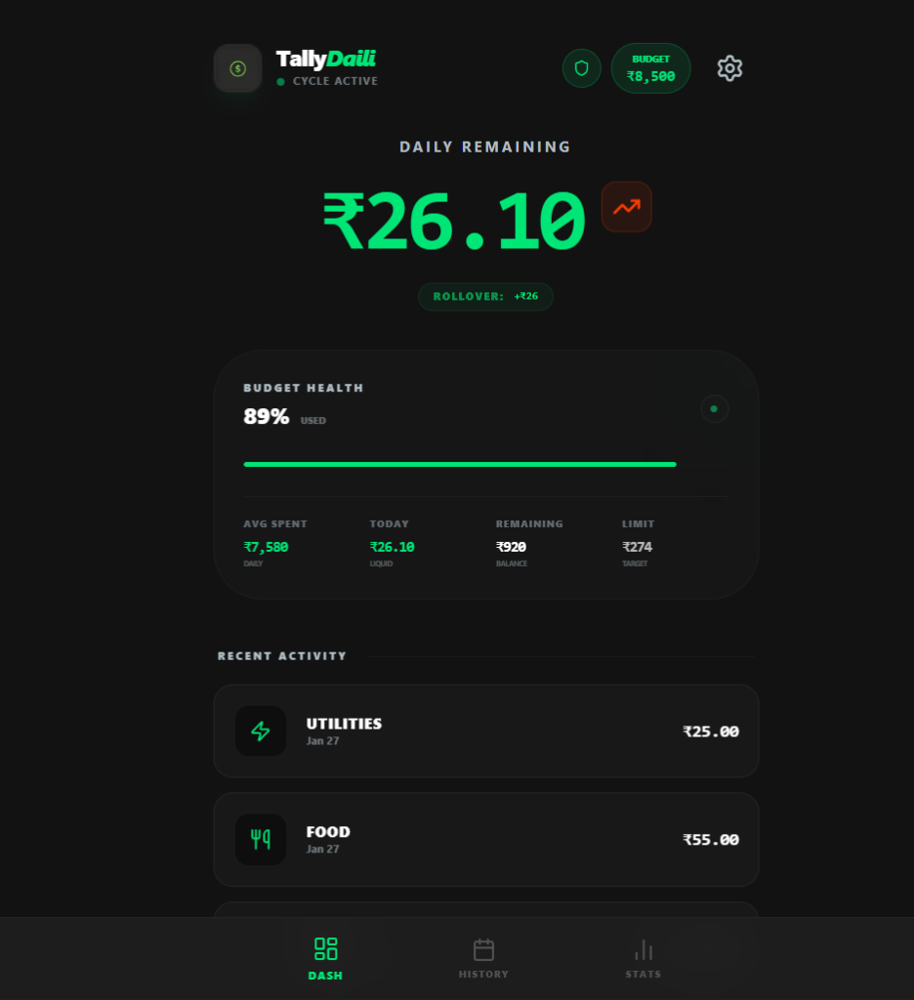
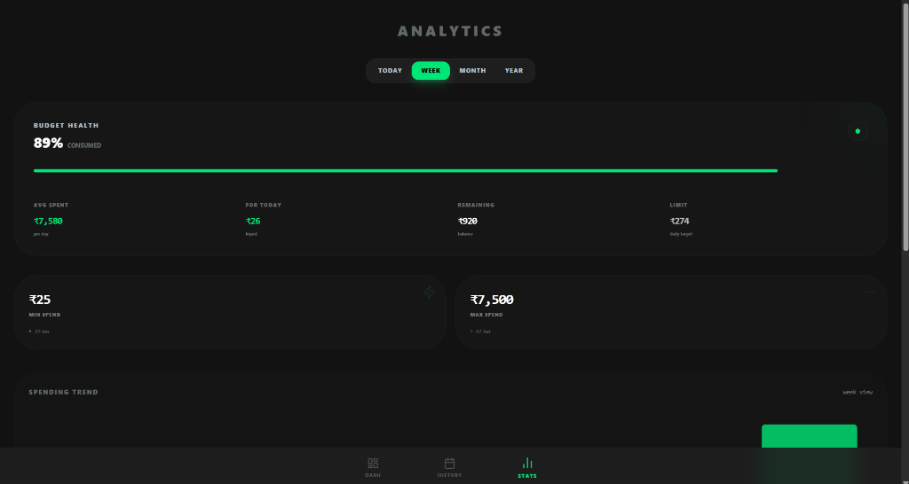
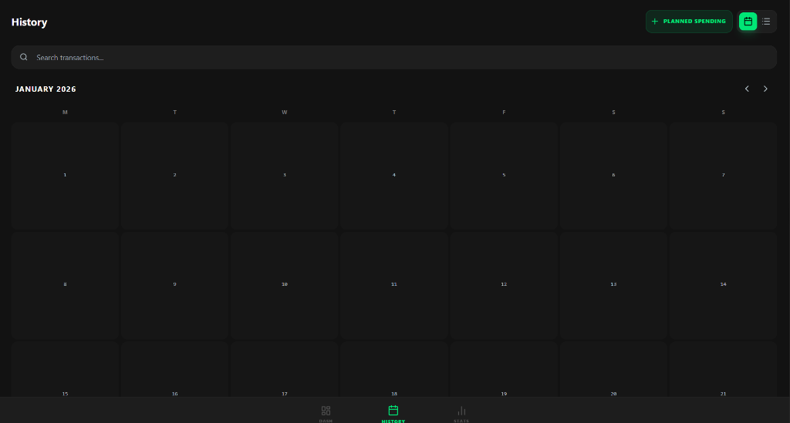

# TallyDaili 💸
### Tactical Daily Budgeting. 100% Private. Built with AI.

TallyDaili is a premium, minimalist budget tracker designed for **tactical daily liquidity**. Unlike traditional apps that focus on monthly categories, TallyDaili tells you exactly how much you can spend **today** while protecting your future bills.

---

## 🌟 Why TallyDaili?

Most budget apps are backward-looking (tracking what you spent). TallyDaili is **forward-looking**:

-   **Daily Allowance Engine**: Automatically recalculates your daily limit based on yesterday's spending.
-   **🛡️ Usage Limit Reminder**: Set a "safety buffer" (e.g., ₹5,000). The app warns you if your total spending eats into this reserve.
-   **📅 Planned Spending**: Reserve money for Rent or EMI. These funds are "hidden" from your daily allowance so you don't accidentally spend them.
-   **🔒 100% Private**: Data lives on your device (IndexedDB). No sign-ups, no servers, no tracking.

---

## 📸 Screenshots

### Dashboard - Your Daily Command Center


The Dashboard shows your **Daily Remaining** amount in bold - this is your "Safe to Spend" number for today. The heat-map health card shows budget usage, average daily spending, and days remaining. The Shield icon indicates your **Planned Spending** buffer.

### Analytics - Spending Intelligence


Visual breakdown of your spending patterns with an interactive pie chart, category-wise distribution, and time-range bar graphs (Today/Week/Month/Year). Track your spending velocity and identify trends.

### History - Calendar & Transactions


A heat-map calendar view showing spending intensity by day. Pulsating indicators mark days with **Planned Spending** reservations. Switch between Calendar and List views to see detailed transaction breakdowns.

---

## 🌟 Key Features

- **Dynamic Daily Allowance**: Automatically calculates your "Safe to Spend" number for today, adjusting in real-time as you log expenses.
- **Planned Spending**: Reserve funds for future obligations (Rent, EMI, Bills). These reservations act as a "shield," hidden from your daily spending power.
- **Heat-map Calendar**: A high-fidelity visual history of your spending velocity.
- **Flexible Budget Cycles**: Choose 7, 14, or 30-day periods during setup, or adjust on-the-fly in settings.
- **Privacy First**: 100% local storage via Dexie.js. No cloud, no tracking, no account required.
- **PWA Ready**: Install it on your Android or iPhone directly from the browser for a native full-screen experience.

---

## 🤖 Built with AI: The Development Story

TallyDaili was created through a high-intensity collaborative process between the **User** and an **Advanced Agentic AI (Antigravity)**.

### How AI was used:
1.  **Iterative Architecture**: The AI didn't just write code; it architected the system using a formal `project_blueprint.md`, ensuring scalability and logic consistency before the first line was written.
2.  **Competitor Intelligence**: The AI performed a real-time `competitor_analysis.md` (vs. Monefy, Goodbudget, Buckwheat) to identify market gaps, leading to the creation of the unique **Planned Spending** shield logic.
3.  **Advanced Pair Programming**: The User provided tactical direction and UI preferences, while the AI managed state logic, persistence (IndexedDB), and high-performance React optimization.
4.  **Mobile-First Refinement**: The AI optimized all touch targets, spacing, and accessibility for a premium 100% Android-compliant feel.
5.  **Automated Verification**: Every feature was verified through AI-driven build checks and linting to ensure production-grade stability.

---

## 🛠️ Tech Stack

- **Framework**: React 19 + TypeScript + Vite
- **Storage**: IndexedDB (via **Dexie.js**)
- **Styling**: Vanilla CSS / Tailwind CSS
- **Icons**: Lucide React
- **State Management**: Zustand
- **Date Utilities**: date-fns

---

## 🚀 Getting Started

1.  **Clone the repo**:
    ```bash
    git clone https://github.com/jeshwanth742/TallyDaili.git
    cd TallyDaili
    ```
2.  **Install dependencies**:
    ```bash
    npm install
    ```
3.  **Run locally**:
    ```bash
    npm run dev
    ```
4.  **Build for production**:
    ```bash
    npm run build
    ```

---

## 📲 How to Install

### Option 1: Download APK (Android)
Go to the **[Actions Tab](../../actions)** in this repository, click the latest workflow run, and download the `app-debug.apk` artifact.

### Option 2: Install as Web App (iOS/Android)
1.  Open the deployed URL (or local server) in Chrome/Safari.
2.  Tap **Share** -> **Add to Home Screen**.
3.  TallyDaili launches as a fullscreen native app.
Download from the link :- https://github.com/jeshwanth742/TallyDaili/actions/runs/21434409565/artifacts/5286069169
---

*Created with ❤️ by Jeshwanth & Antigravity AI.*
